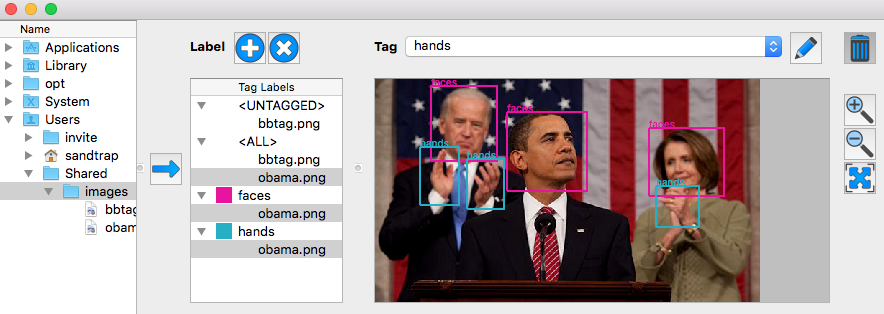

# BBTag

BBTag is meant to be used for tagging (i-e labeling rectangles) images, which is a tedious task for people who need to make their own dataset for supervised machine learning. In a nutshell, the advantages of BBTag are: 
* **multiple labeling**: each image can be tagged multiple times with different labels. 
* **label organization**: a BBTag session is grouped by label. It becomes very easy to know which labels are present in each image without having to view the images one by one. An "Untagged" section is also provided by default to quickly find out which images need to be tagged. 
* **worry-free tagging**: add and remove tags as needed. If you got a tag wrong, delete it and tag again without impacting any other tag. 
* **selective saving**: save your entire BBTag session or just a subset based on image and/or labels. You can reuse the same pool of images for different purposes (e.g. save only "faces" and "body", then "person", etc. regardless of the overlap between each tag). 
* **XML or image part output**: save your dataset as 
  * XML file: it will containing the path to images and label bounding box coordinates. This file can be directly input in dlib for instance. You may also read the data with python and appropriate XML package. 
  * Image part files: it will output one folder per label. Each label folder will contain the image part cropped by the bounding boxes for that label. It could be useful for direct input to train Deep Learning networks for instance. 

## Installation
* Either download [v1.0 release](https://github.com/clavicule/BBTag/releases) for MacOSX or Ubuntu-15
* Or build it from source:
  1. download the source code: `git clone https://github.com/clavicule/BBTag.git`
  2. download and install Qt 5.x (originally built and tested against Qt 5.5)
  3. build BBTag: 
    * either run `qmake` then `make` (or equivalent depending on your platform)
    * or load BBTag.pro in Qt Creator and go to Build > Build Project "BBTag"

## Improvements
Please, don't hesitate to report any issue or enhancements requests.
